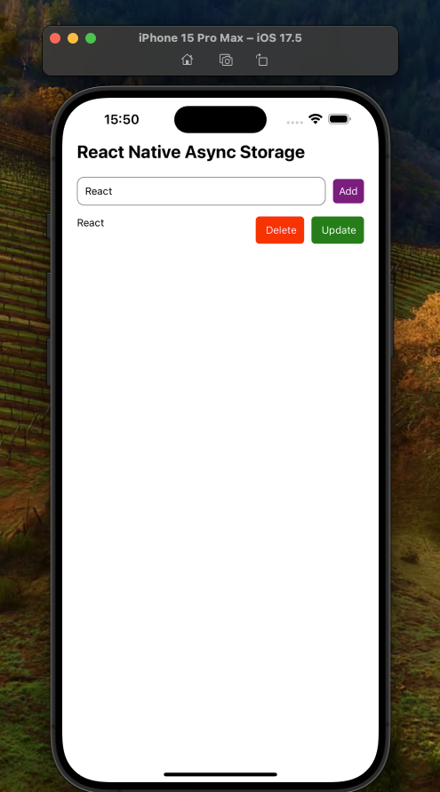

# React Native AsyncStorage Todo Uygulaması

## Proje Amacı

Bu proje, kullanıcılara React Native'de AsyncStorage kullanarak bir "Yapılacaklar Listesi" (Todo List) uygulaması geliştirmeyi göstermeyi amaçlamaktadır. Kullanıcılar bu uygulama sayesinde görevlerini ekleyebilir, güncelleyebilir, silebilir ve cihazda yerel olarak saklayabilirler. Uygulama kapansa bile, saklanan görevler yeniden yüklendiğinde AsyncStorage kullanılarak geri getirilecektir.

## Özellikler

- Kullanıcı, TextInput alanına yazdığı bir görevi listeye ekleyebilir.
- Eklenen görev, silme butonuna basılarak listeden kaldırılabilir.
- Kullanıcı, listedeki bir görevi güncelleyebilir.
- AsyncStorage kullanılarak görevler yerel depolamada saklanır ve uygulama yeniden açıldığında bu veriler yüklenir.

## Bilesenler

### TodoScreen

- **todo**: Kullanıcının TextInput alanına girdiği değeri saklar.
- **todos**: Tüm görevlerin listesini saklar.

### Fonksiyonlar

- **saveTodos**: Görevleri AsyncStorage'a kaydeder.
- **loadTodos**: AsyncStorage'daki görevleri yükler.
- **deleteTodo**: Seçilen görevi siler ve AsyncStorage'ı günceller.
- **updatedTodos**: Seçilen görevi düzenler ve AsyncStorage'ı günceller.
- **addTodo**: Yeni bir görev ekler ve kaydeder.

## Kullanılan Kütüphaneler

- **react-native:**  
   React Native uygulama geliştirme için temel yapı.
- **react-native-uuid:**  
  Her yeni görev için benzersiz bir ID oluşturmak amacıyla kullanılır.
- **@react-native-async-storage/async-storage:**  
  Görevlerin cihazda kalıcı olarak saklanması için kullanılan yerel depolama çözümü.

## Ekran Görüntüsü

